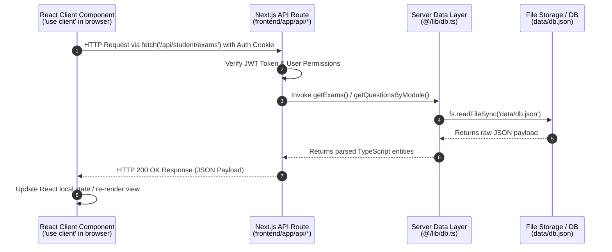

# CACULUS System Architecture & Boundary Map

This document serves as the primary architectural map for the **CACULUS TSA Examination & Assessment Platform**. It defines the directory structure, data lifecycle, and the strict Client vs. Server execution boundaries required to ensure system safety and prevent runtime errors (such as `fs is not defined`).

---

## 1. Directory Structure Overview

The project is structured as a full-stack monorepo featuring a Next.js 15+ App Router web application alongside a standalone Node.js Express API service.

```
caculus/
├── backend/                  # Standalone Express.js API Server
│   ├── src/
│   │   └── index.ts          # Express server entry point & health endpoints
│   ├── package.json          # Backend dependencies (express, cors, dotenv)
│   └── tsconfig.json         # TypeScript configuration for backend
│
└── frontend/                 # Next.js 15+ App Router Web Application
    ├── app/                  # Next.js App Router (Pages, Layouts, API Routes)
    │   ├── admin/            # Administrative portal (Exams, Users, Anti-cheat logs)
    │   ├── dashboard/        # Student portal (Assigned exams, History, Results)
    │   ├── api/              # Server-side Next.js Route Handlers (/api/auth, /api/admin, /api/student)
    │   ├── layout.tsx        # Root UI layout & font configurations
    │   └── page.tsx          # Landing / portal redirection root
    │
    ├── components/           # React UI Components (Client & Server Components)
    │   ├── AntiCheatMonitor.tsx
    │   ├── QuestionCard.tsx
    │   └── ...
    │
    ├── data/                 # Local persistent storage directory
    │   └── db.json           # JSON-file based database storage
    │
    ├── lib/                  # Server-side business logic & storage adapters (aliased `@/lib` / `src/lib`)
    │   ├── db.ts             # File system data provider (fs, path, db.json CRUD)
    │   ├── auth.ts           # JWT authentication & bcrypt password hashing
    │   └── mockData.ts       # Initial seed data for users, exams, & questions
    │
    ├── types/                # TypeScript interfaces & domain models
    │   └── index.ts          # Schemas for User, Exam, Question, Submission, AntiCheatLog
    │
    ├── package.json          # Frontend dependencies (next, react, lucide-react, etc.)
    └── tsconfig.json         # Path alias definitions (@/* maps to ./*)
```

### Detailed Component Roles

#### `backend/`
* **Purpose**: Serves as a standalone Node.js / Express microservice.
* **Responsibilities**: Provides standalone health check endpoints (`/` and `/api/health`), API services, and optional background worker services isolated from the Next.js frontend runtime.

#### `frontend/app/admin/` (or `frontend/src/app/admin/`)
* **Purpose**: Administrative control panel for test creators and system administrators.
* **Responsibilities**:
  * Managing exam configurations, time limits, and module structures.
  * Question bank creation and editing (Multiple Choice, Drag-and-Drop, Short Answer).
  * Real-time monitoring of anti-cheat violations and proctor logs.
  * Viewing student submission histories and analytics.

#### `frontend/app/dashboard/` (or `frontend/src/app/dashboard/`)
* **Purpose**: Student examination workspace and personal analytics dashboard.
* **Responsibilities**:
  * Displaying active, upcoming, and past TSA examination attempts.
  * Hosting the interactive examination interface with embedded timer and anti-cheat triggers.
  * Rendering performance summaries, score breakdowns, and leaderboard ranks.

#### `src/lib/` / `frontend/lib/` (`@/lib/`)
* **Purpose**: Server-only utility layer and local database engine.
* **Responsibilities**:
  * [`db.ts`](file:///c:/Users/Admin/.gemini/antigravity/scratch/caculus/frontend/lib/db.ts): Directly accesses Node.js native `fs` and `path` modules to read and persist application data to [`data/db.json`](file:///c:/Users/Admin/.gemini/antigravity/scratch/caculus/frontend/data/db.json).
  * [`auth.ts`](file:///c:/Users/Admin/.gemini/antigravity/scratch/caculus/frontend/lib/auth.ts): Handles password hashing (`bcryptjs`), JWT token signing, and HTTP cookie verification.
  * [`mockData.ts`](file:///c:/Users/Admin/.gemini/antigravity/scratch/caculus/frontend/lib/mockData.ts): Default seed models and mock datasets for fallback initialization.

---

## 2. End-to-End Data Flow

Data in CACULUS follows a single-direction client-server lifecycle. Client components never access file storage or backend utility functions directly.



### Step-by-Step Execution Lifecycle

1. **User Action (UI Component)**:
   * A user clicks "Start Exam" or submits an answer card inside a Client Component (e.g., `'use client'` component in `app/dashboard/page.tsx`).
   * Client-side validation runs, and a fetch request is dispatched to a relative endpoint (e.g., `POST /api/student/submissions`).

2. **Route Handler Processing (Server Environment)**:
   * The request hits the Next.js API Route Handler in [`frontend/app/api/student/...`](file:///c:/Users/Admin/.gemini/antigravity/scratch/caculus/frontend/app/api).
   * The handler extracts the authentication cookie (`caculus_token`), verifies JWT credentials via `@/lib/auth`, and parses the request payload.

3. **Data Layer & Storage Access (Node.js Server)**:
   * The route handler calls methods in [`@/lib/db.ts`](file:///c:/Users/Admin/.gemini/antigravity/scratch/caculus/frontend/lib/db.ts) (e.g., `createSubmission()`).
   * `db.ts` uses Node.js `fs.readFileSync` / `fs.writeFileSync` to read or mutate [`data/db.json`](file:///c:/Users/Admin/.gemini/antigravity/scratch/caculus/frontend/data/db.json) synchronously or asynchronously.

4. **Response & Client Re-render**:
   * The route handler returns a structured `NextResponse.json(...)`.
   * The browser receives the JSON response, updates React state (`useState`, `useReducer`), and updates the DOM.

---

## 3. Client vs. Server Boundary Specification

To prevent catastrophic bundling errors such as **`Module not found: Can't resolve 'fs'`** or **`fs is not defined`**, strict isolation boundaries must be observed between Client and Server execution environments.

### Environment Matrix

| Boundary Feature | Server Environment (`Node.js`) | Client Environment (`Browser Runtime`) |
| :--- | :--- | :--- |
| **Modules / Directives** | Route Handlers (`app/api/**/route.ts`), `@/lib/db.ts`, Server Components | Components marked with `'use client'`, hooks (`useState`, `useEffect`) |
| **Allowed File Access** | Native Node.js `fs`, `path`, `os` | **FORBIDDEN** (Causes bundling failure) |
| **Secrets & Keys** | System env vars (`process.env.SECRET_KEY`, JWT keys) | Only public env vars (`NEXT_PUBLIC_*`) |
| **State Management** | Ephemeral per-request memory, server files | React Component State, `localStorage`, DOM events |
| **Authentication** | Signing tokens, verifying passwords, setting HTTP-only cookies | Storing token reference (if non-HTTP-only), triggering login redirects |

---

### Critical Boundary Rules

> [!CAUTION]
> **RULE #1: Never import `@/lib/db` or Node.js native modules (`fs`, `path`, `crypto`) inside any file containing `'use client'`.**

#### Incorrect Code (Causes `fs is not defined` runtime failure):
```tsx
// ❌ WRONG: Importing db.ts inside a Client Component
'use client';
import { getUsers } from '@/lib/db'; // 💥 Fails at runtime in Webpack/Browser!

export default function UserList() {
  const users = getUsers(); // Node.js 'fs' does not exist in the browser!
  return <div>{users.length} Users</div>;
}
```

#### Correct Code (Client Component fetching via API Handler):
```tsx
// ✅ CORRECT: Client Component calling API route
'use client';
import { useState, useEffect } from 'react';

export default function UserList() {
  const [users, setUsers] = useState([]);

  useEffect(() => {
    fetch('/api/admin/users')
      .then((res) => res.json())
      .then((data) => setUsers(data.users));
  }, []);

  return <div>{users.length} Users</div>;
}
```

#### Correct Code (Server-side API Route Handler):
```typescript
// ✅ CORRECT: API Route Handler running on Node.js Server
// File: app/api/admin/users/route.ts
import { NextResponse } from 'next/server';
import { getUsers } from '@/lib/db'; // Safe: Running on Server

export async function GET() {
  const users = getUsers();
  return NextResponse.json({ users });
}
```

---

## 4. Architectural Safeguards & Verification Checklist

Before committing changes to the codebase, verify compliance against the following rules:

1. **Import Safeguards**: Check all new components. If a component starts with `'use client'`, confirm it does not import `@/lib/db`, `@/lib/auth`, or `fs`.
2. **API Route Layer**: Ensure all file system operations and state mutations occur exclusively within `app/api/...` route handlers or Server Actions.
3. **TypeScript Path Aliases**: Always use `@/lib/...`, `@/components/...`, and `@/types/...` to maintain consistent resolution across server and client boundaries.
